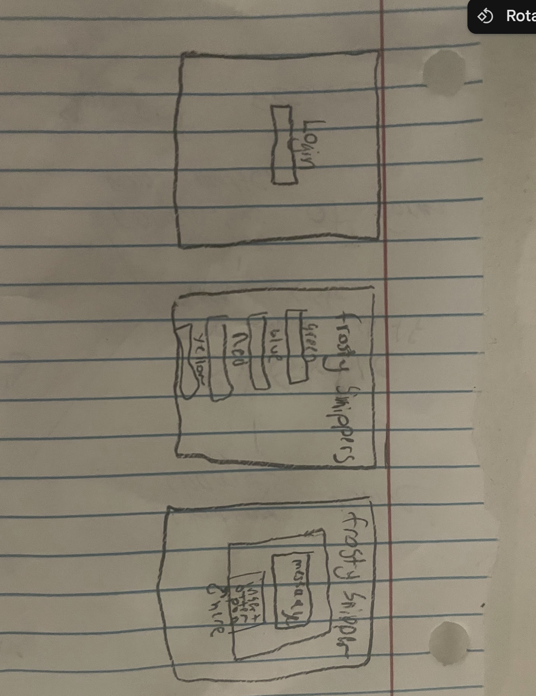

# Frosty Snippers

[My Notes](notes.md)

My application will allow someone to be able to add a message to a certain color of otter pop and when that otter pop gets cut it will display that message 

> [!NOTE]
>  This is a template for your startup application. You must modify this `README.md` file for each phase of your development. You only need to fill in the section for each deliverable when that deliverable is submitted in Canvas. Without completing the section for a deliverable, the TA will not know what to look for when grading your submission. Feel free to add additional information to each deliverable description, but make sure you at least have the list of rubric items and a description of what you did for each item.

> [!NOTE]
>  If you are not familiar with Markdown then you should review the [documentation](https://docs.github.com/en/get-started/writing-on-github/getting-started-with-writing-and-formatting-on-github/basic-writing-and-formatting-syntax) before continuing.

## 🚀 Specification Deliverable

> [!NOTE]
>  Fill in this sections as the submission artifact for this deliverable. You can refer to this [example](https://github.com/webprogramming260/startup-example/blob/main/README.md) for inspiration.

For this deliverable I did the following. I checked the box `[x]` and added a description for things I completed.

- [x] Proper use of Markdown
- [x] A concise and compelling elevator pitch
- [x] Description of key features
- [x] Description of how you will use each technology
- [x] One or more rough sketches of your application. Images must be embedded in this file using Markdown image references.

### Elevator pitch

Imagine a fun, interactive way to send personalized messages! My application lets you add a custom message to a specific color of Otter Pop. When the Otter Pop is cut, your message is revealed, creating a surprise moment for the recipient. Whether it’s for a special occasion, a fun reveal, or just a unique way to communicate, this application brings creativity and joy to an everyday treat!

### Design

### Key features

- I will have a login and logout 
- customizable messages that you create 
- A way for the message to be display 

### Technologies

I am going to use the required technologies in the following ways.

- **HTML** - I will have a login page and then a page on where you can create a message and then a page where you can see the message display
- **CSS** - I will have a color scheme and a I will have a design that will be able to see and images 
- **React** - Your messages will be able to show on the Screen of an automatic otter pop cutter instantly 
- **Service** - this will display a random quote gernator that gives you examples of inspiring quotes you can use for your messages 
- **DB/Login** - stores messages that you create and stores the login users
- **WebSocket** - will pop a message of users most used messages 

## 🚀 AWS deliverable

For this deliverable I did the following. I checked the box `[x]` and added a description for things I completed.

- [x] **Server deployed and accessible with custom domain name** - [My server link](http://frostysnippers.com/).

## 🚀 HTML deliverable

For this deliverable I did the following. I checked the box `[x]` and added a description for things I completed.

- [x] **HTML pages** - I did not complete this part of the deliverable.
- [x] **Proper HTML element usage** - I did not complete this part of the deliverable.
- [x] **Links** - I did not complete this part of the deliverable.
- [x] **Text** - I did not complete this part of the deliverable.
- [x] **3rd party API placeholder** - I did not complete this part of the deliverable.
- [x] **Images** - I did not complete this part of the deliverable.
- [x] **Login placeholder** - I did not complete this part of the deliverable.
- [x] **DB data placeholder** - I did not complete this part of the deliverable.
- [x] **WebSocket placeholder** - I did not complete this part of the deliverable.

## 🚀 CSS deliverable

For this deliverable I did the following. I checked the box `[x]` and added a description for things I completed.

- [x] **Header, footer, and main content body** - I added a header footer and main content to the html and css
- [x] **Navigation elements** -I was able to make it so you can naviagte from page to page 
- [x] **Responsive to window resizing** - I made it so that you can resize to a smaller screen 
- [x] **Application elements** - I was able to add application elemets 
- [x] **Application text content** - I was able to add some spplication text content 
- [x] **Application images** - I added an image of some otter pops

## 🚀 React part 1: Routing deliverable

For this deliverable I did the following. I checked the box `[x]` and added a description for things I completed.

- [ ] **Bundled using Vite** - I did not complete this part of the deliverable.
- [ ] **Components** - I did not complete this part of the deliverable.
- [ ] **Router** - Routing between login and voting components.

## 🚀 React part 2: Reactivity

For this deliverable I did the following. I checked the box `[x]` and added a description for things I completed.

- [ ] **All functionality implemented or mocked out** - I did not complete this part of the deliverable.
- [ ] **Hooks** - I did not complete this part of the deliverable.

## 🚀 Service deliverable

For this deliverable I did the following. I checked the box `[x]` and added a description for things I completed.

- [ ] **Node.js/Express HTTP service** - I did not complete this part of the deliverable.
- [ ] **Static middleware for frontend** - I did not complete this part of the deliverable.
- [ ] **Calls to third party endpoints** - I did not complete this part of the deliverable.
- [ ] **Backend service endpoints** - I did not complete this part of the deliverable.
- [ ] **Frontend calls service endpoints** - I did not complete this part of the deliverable.

## 🚀 DB/Login deliverable

For this deliverable I did the following. I checked the box `[x]` and added a description for things I completed.

- [ ] **User registration** - I did not complete this part of the deliverable.
- [ ] **User login and logout** - I did not complete this part of the deliverable.
- [ ] **Stores data in MongoDB** - I did not complete this part of the deliverable.
- [ ] **Stores credentials in MongoDB** - I did not complete this part of the deliverable.
- [ ] **Restricts functionality based on authentication** - I did not complete this part of the deliverable.

## 🚀 WebSocket deliverable

For this deliverable I did the following. I checked the box `[x]` and added a description for things I completed.

- [ ] **Backend listens for WebSocket connection** - I did not complete this part of the deliverable.
- [ ] **Frontend makes WebSocket connection** - I did not complete this part of the deliverable.
- [ ] **Data sent over WebSocket connection** - I did not complete this part of the deliverable.
- [ ] **WebSocket data displayed** - I did not complete this part of the deliverable.
- [ ] **Application is fully functional** - I did not complete this part of the deliverable.
